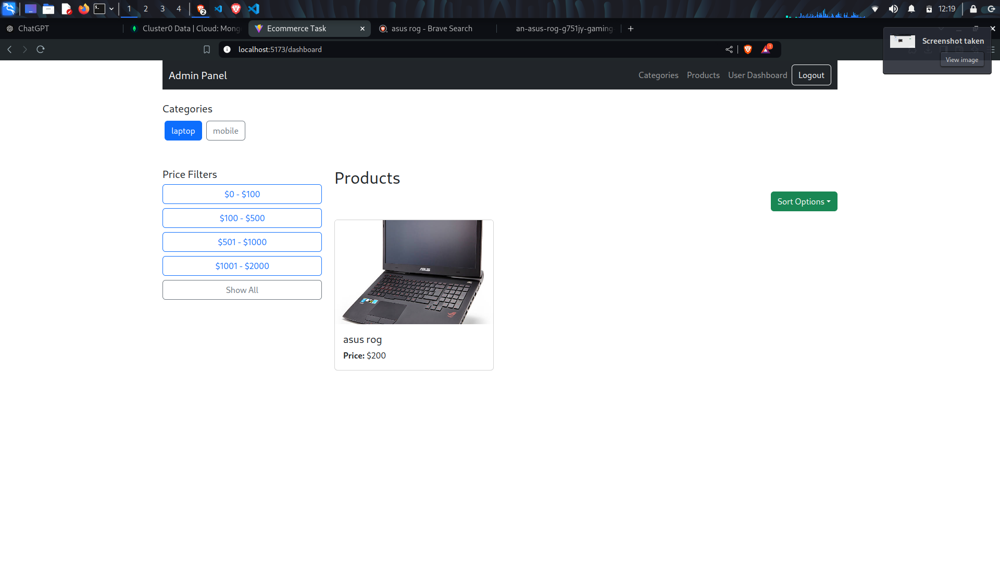
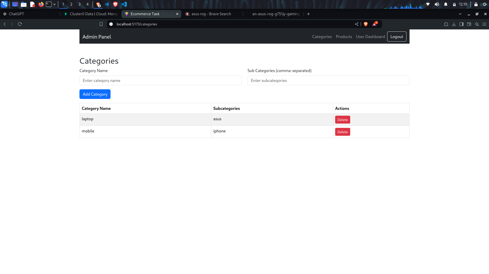
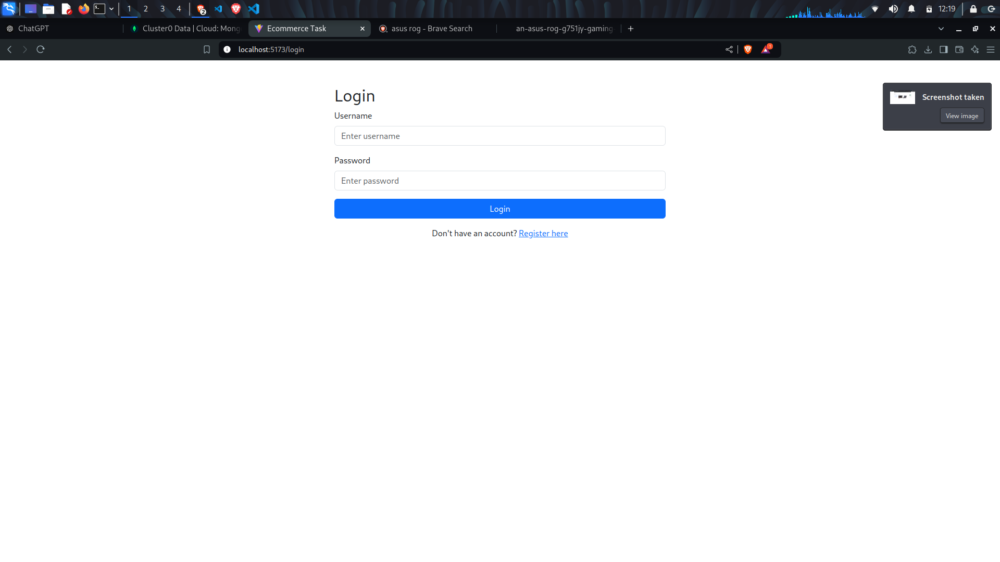
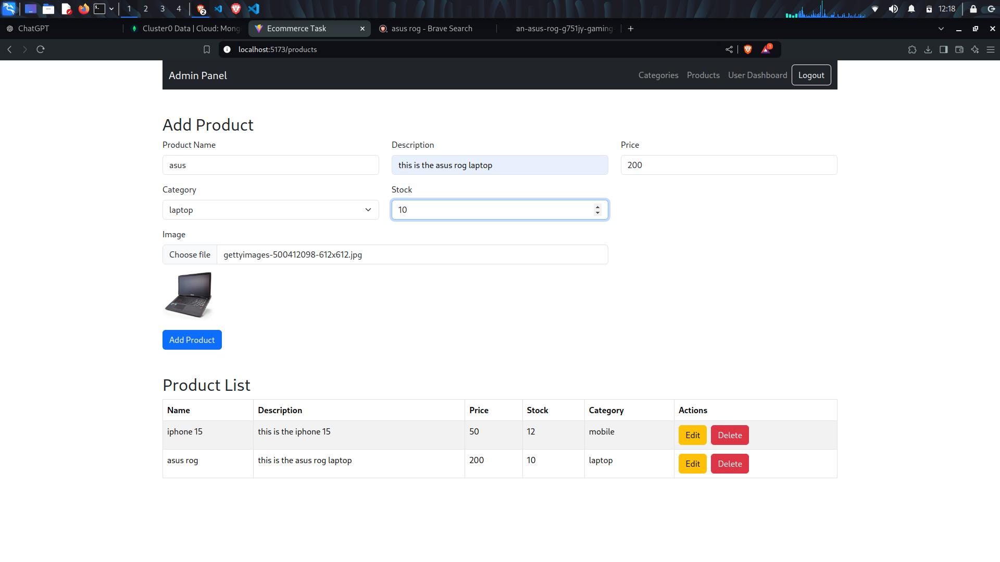
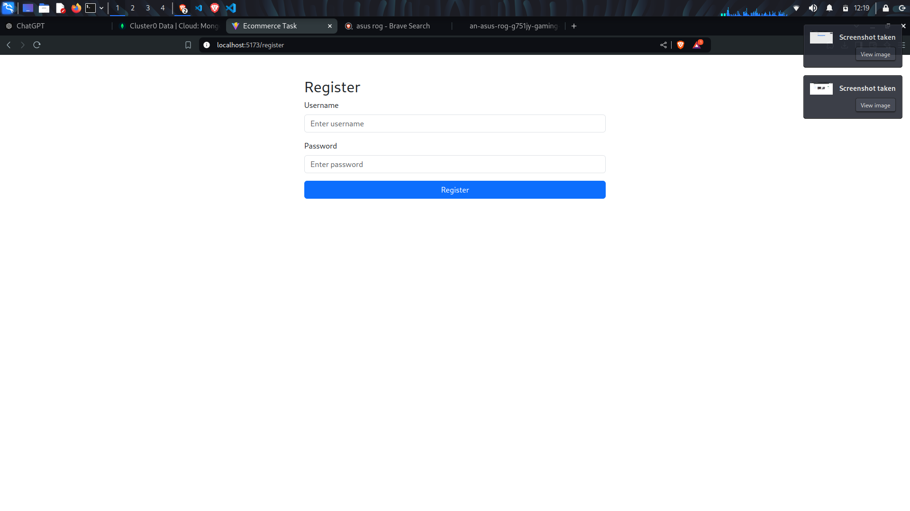
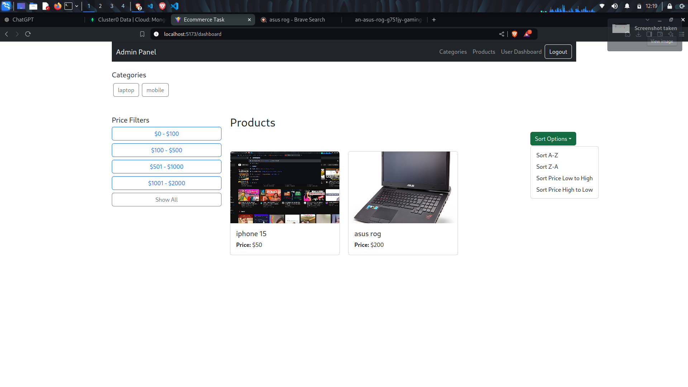
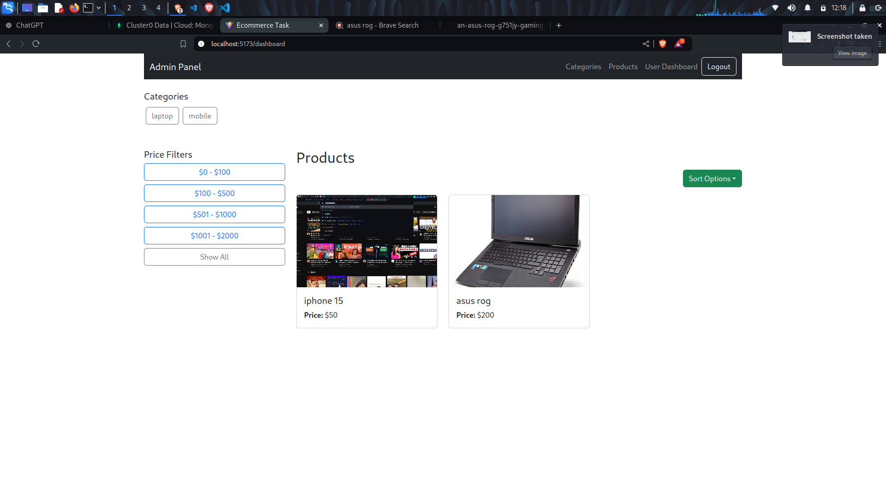

# E-commerce Admin Dashboard

This E-commerce Admin Dashboard is a web application built using Node.js and React.js. It allows administrators to manage products and categories efficiently, providing a user-friendly interface for CRUD operations. The dashboard includes features for managing product details, stock levels, and category hierarchies.

## Features

### Product Management
- **Add Product**: Add new products to the database with details such as name, description, price, stock quantity, category, and product image.
- **Edit Product**: Update existing products. The current product image is displayed while editing, with the option to upload a new image.
- **Delete Product**: Remove products from the database with a confirmation prompt to prevent accidental deletions.
- **View Product List**: Display a comprehensive list of all products with their details, including name, description, price, stock, category, and image.

### Category Management
- **Add Category**: Create new categories to organize products effectively.
- **Edit Category**: Modify existing category details, including subcategory support.
- **Delete Category**: Remove categories from the database, ensuring that related products are handled appropriately.

### User Authentication
- **Secure Login**: Admin users must log in to access the dashboard, ensuring that only authorized users can manage products and categories.

### Responsive Design
- **Mobile-Friendly UI**: The dashboard is designed to be responsive, providing a seamless experience across devices, including tablets and smartphones.

### Form Validation
- **Input Validation**: The application includes form validation to ensure that required fields are filled correctly before submission, enhancing data integrity.

## Technologies Used
- **Frontend**: React.js, React-Bootstrap
- **Backend**: Node.js, Express.js
- **Database**: MongoDB
- **File Upload**: Multer for handling image uploads

## Getting Started

### Prerequisites
- Node.js and npm installed on your machine.
- MongoDB installed and running.

### Installation

1. Clone the repository:
   ```bash
   git clone <repository-url>
   cd e-commerce-admin-dashboard









